  

  
  
  

Java + Spring Boot developer in fintech. Core banking, payments and Open Banking — systems where a retry must never become a second withdrawal.

### 🪐 Stack in orbit

  

---

### 📡 Telemetry

  
  

  

  

